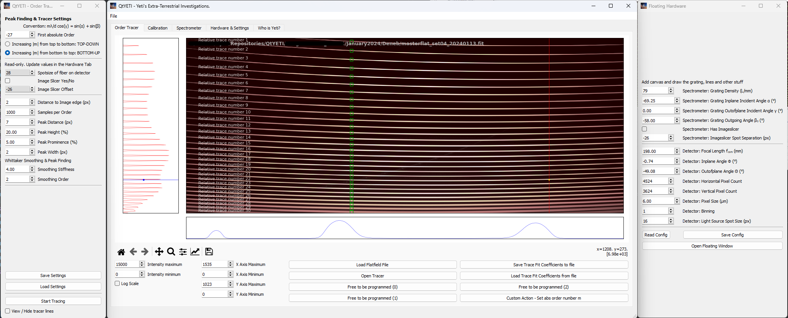

# Welcome to QtYETI - Yeti's Extra Terrestrial Investigations
QtYETI is a program meant to faciliate the data reduction of Echelle spectra with and without image slicers.  
  
2022-2024 Jakob Wierzbowski <jw.echelle@outlook.com>

### Disclaimer
This program is in its beginning stages. It is possible to fit and extract 1D spectra from 2D spectrograms.  
A spectral calibration is under development.  
Everything has been tested in a native python environment. Currently we have no experience using `conda` environments.

## Before you start
python[.exe] -m pip install --upgrade pip  
pip install --upgrade setuptools

### Requirements
pip install 
astropy>=6.0.0
configparser
datetime
matplotlib==3.6.3
numpy
scipy
pyqt5

### Start QtYETI
• Navigate to the directory where QtYETI has been extracted to  
• Use "python ./QtYeti.py"  

### Features
In the `Calibration` Tab you can find a geometric calibrator that has been used to sucessfully predict ThAr lines in <a target="_blank" rel="noopener noreferrer" href="https://arxiv.org/abs/2401.00105">our manuscript</a>.

### Tested Operating Systems
• Windows 10/11 64bit  
• Linux Mint 21.2 (Codename: Victoria)  
• Ubuntu Linux 22.04  

#### Yeti

